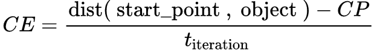

# Adversarial Attack Method Based on IGA

This repository contains the codes and experimental data for the paper:
**Dingming Yang, Zeyu Yu, Hongqiang Yuan & Yanrong Cui. (2021). An Improved Genetic Algorithm and Its Application in Neural Network Adversarial Attack.** [[arxiv](https://arxiv.org/abs/2110.01818)] [[code](https://github.com/huangyebiaoke/adversarial-attack-method-based-on-IGA)]

<div align=center></div>
<!--  -->

## MNIST dataset analysis


## Improved Genetic Algorithm
### SGA, PSO, GWO, IGA


### SGA, SGA with A1, SGA with A1+A2


### The calculation method of convergence efficiency



## Result


## Citation

If you use the code, data or images provided in this repository, please cite this work as follows:
```
@misc{yang2021improved,
      title={An Improved Genetic Algorithm and Its Application in Neural Network Adversarial Attack}, 
      author={Dingming Yang and Zeyu Yu and Hongqiang Yuan and Yanrong Cui},
      year={2021},
      eprint={2110.01818},
      archivePrefix={arXiv},
      primaryClass={cs.NE}
}
```

## Acknowledgement

- [MaxFunVal](https://github.com/huangyebiaoke/MaxFunVal)

- [deep-learning-from-scratch](https://github.com/oreilly-japan/deep-learning-from-scratch)

## License

[GPL-3.0](https://choosealicense.com/licenses/gpl-3.0/)